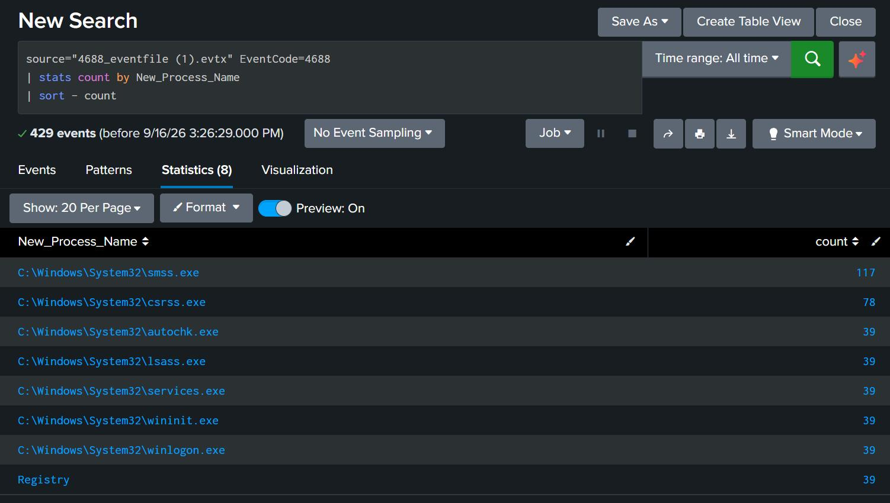
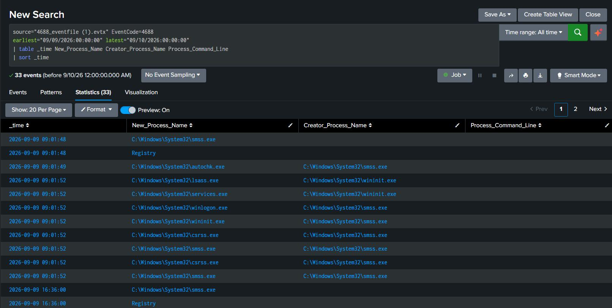
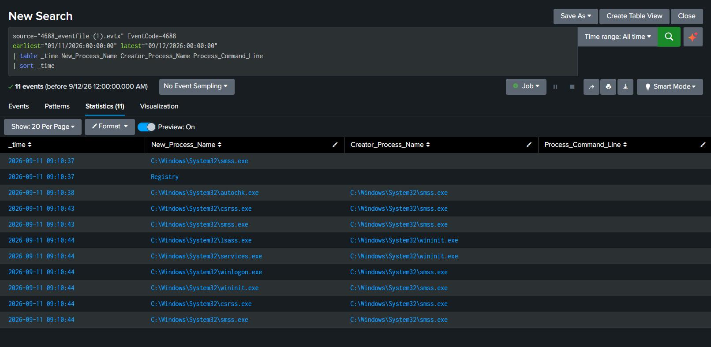
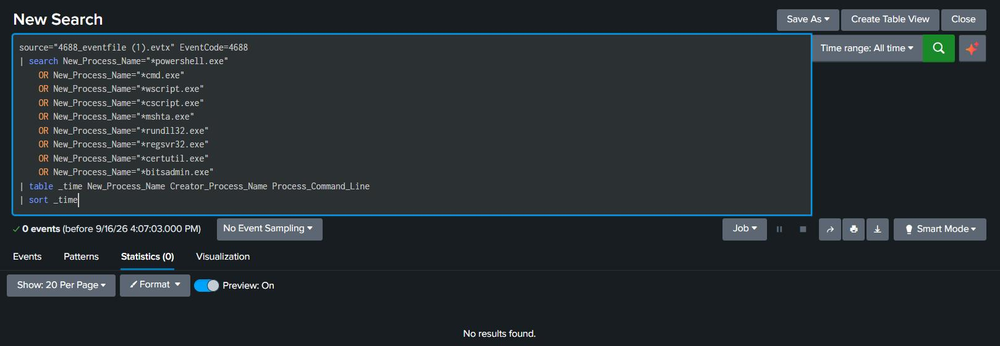
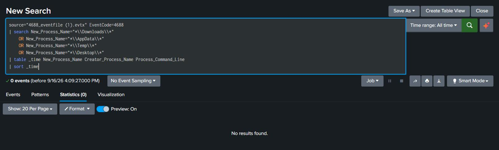
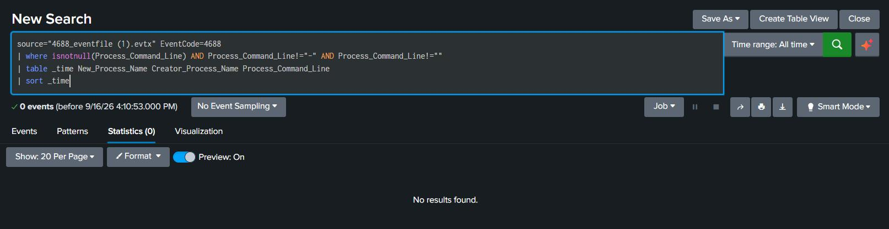

# Evidence Screenshots

This directory contains screenshots supporting the Windows Security Incident Investigation case study.

## Evidence Index

| No. | Screenshot | Description |
|---|---|---|
| 1 | Splunk Dataset Overview | Overview of the Windows Security Event ID 4688 dataset analyzed in Splunk. |
| 2 | Process Review — 9 September | Process activity reviewed for 9 September 2026. |
| 3 | Process Review — 11 September | Process activity reviewed for 11 September 2026. |
| 4 | LOLBin Hunting | Search for potentially suspicious activity involving Living-off-the-Land Binaries. |
| 5 | User-Writable Path Hunting | Search for process activity involving user-writable paths. |
| 6 | Command-Line Availability | Evidence showing the availability limitation of process command-line data. |

## Screenshots

### 1. Splunk Dataset Overview

### 2. Process Review — 9 September

### 3. Process Review — 11 September

### 4. LOLBin Hunting

### 5. User-Writable Path Hunting

### 6. Command-Line Availability

